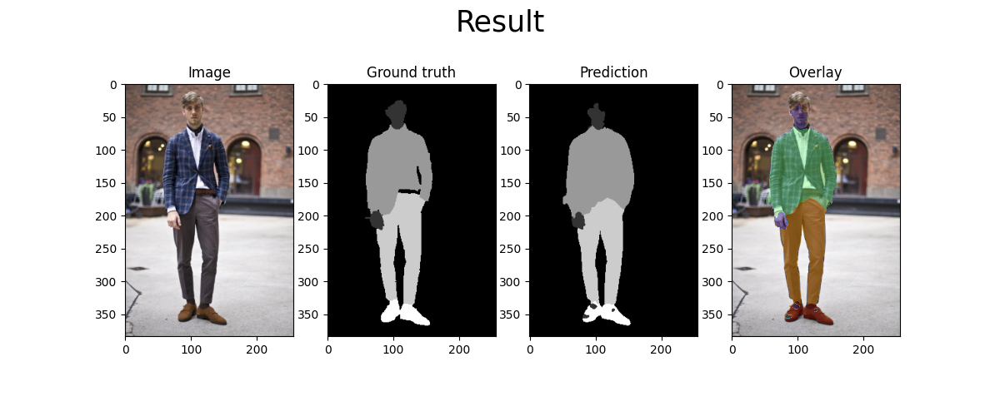

# clothing-segmentation
Practicing how to fine-tune NN models designed for image segmentation tasks, beware lots of comments in code (trying to learn!).


# Getting Started

Follow these steps to run this project on your local machine:

1. Clone this repository:
   ```
   git clone https://github.com/your-username/clothing-segmentation.git
   cd clothing-segmentation
   ```

2. Download the Clothing-Co-Parsing dataset from [bearpaw's repository](https://github.com/bearpaw/clothing-co-parsing).

3. Set up the directory structure:
   ```
   mkdir -p data/annotations data/input_images/images
   ```

4. Add the annotations from the dataset:
   - Place the `image-level` folder in `data/annotations/`
   - Place the `pixel-level` folder in `data/annotations/`

5. Add the images from the dataset:
   - Place all the images in `data/input_images/images`

6. Run the pre-processing script:
   ```
   python -m scripts.pre_processing
   ```
   This will create masks in `data/input_images/masks/` and distribute images into train and validation dataset folders.

7. Start the training process:
   ```
   python -m scripts.train
   ```

## Requirements

Before installing the dependencies, it's recommended to create a virtual environment:

1. Create a virtual environment:
   ```
   python -m venv venv
   ```

2. Activate the virtual environment.

3. Install the required dependencies using the `requirements.txt` file:
   ```
   pip install -r requirements.txt
   ```

# Results



# Citations
Dataset from: https://github.com/bearpaw/clothing-co-parsing
```python
@inproceedings{yang2014clothing,
  title={Clothing Co-Parsing by Joint Image Segmentation and Labeling},
  author={Yang, Wei and Luo, Ping and Lin, Liang}
  booktitle={Computer Vision and Pattern Recognition (CVPR), 2014 IEEE Conference on},
  year={2013},
  organization={IEEE}
}
```

References code from:
https://github.com/IzPerfect/Clothing-Segmentation/tree/master