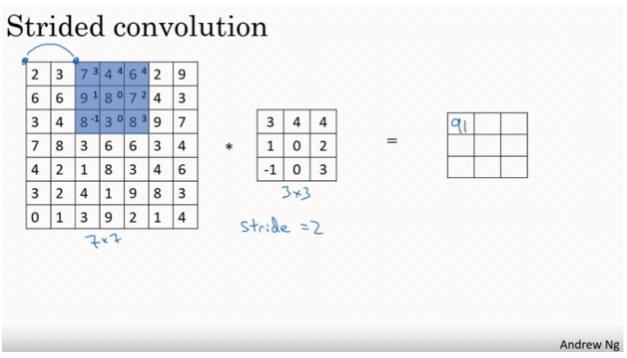
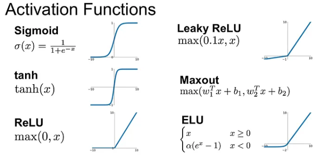
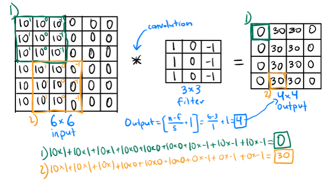
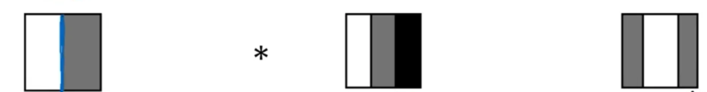
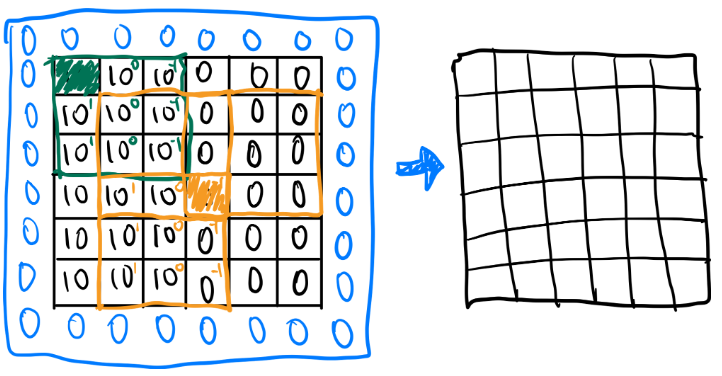

# U-Net Architecture

- Architecture Overview
    1. **Contracting Path (Left Side of U):**
        - The contracting path consists of multiple blocks, each typically containing two 3x3 convolutional layers followed by a ReLU activation function.
        - Each block is usually followed by a 2x2 max pooling operation with stride 2, which reduces the spatial dimensions of the feature maps by half and increases the feature depth. This down sampling step helps in extracting increasingly abstract features from the input image at multiple scales.
    2. **Bottleneck (Bottom of U):**
        - At the bottom of the U, there is a bottleneck which usually contains two 3x3 convolutions and ReLU activations without any pooling. This part is crucial as it bridges the contracting and expansive paths.
    3. **Expansive Path (Right Side of U):**
        - The expansive path mirrors the contracting path but in reverse. It typically includes a series of up sampling steps, each followed by a 2x2 transposed convolution (or up-convolution) that doubles the dimensions of the feature maps.
        - After up sampling, the feature map is concatenated with the correspondingly cropped feature map from the contracting path. This step is crucial and is known as **skip connection**. It helps the network recover spatial information lost during down sampling.
        - Each up sampling is followed by two 3x3 convolutions and ReLU activations.
    4. **Final Layer:**
        - The architecture typically concludes with a 1x1 convolution that maps the final feature maps to the desired number of classes for segmentation.
 

## The Module

It uses a sequential module that runs the contained sub modules in sequence to simplify the construction of the neural network. These sub modules consists of a double convolution layer with a 3x3 filter. 

It performs three sets of operations: convolution, batch normalization, and a ReLU activation.

You can see in the architecture above each block consists of two 3x3 conv (blue arrow) layers and a ReLU activation layer. There are 9 blocks in total.

## 2D Convolution Layer

Applies a filter to the input to extract features by sliding over the input spatially. It helps in detecting features like edges, textures, etc.

### Input Channels

Specifies the number of channels for the input image. E.g. a standard RGB image would have 3 channels (red, green, and blue).
 

### Output Channels

Specifies the number of filters that will be applied to the input image determining the number of feature maps the convolution layer will produce. E.g. a 1 output channel is a binary image segmentation task that just focuses on object and background or a 5 output channel is a multi-class channel that focuses on multiple categories such as different types of clothing, background, skin, etc.
 

### Kernel Size (Filters)

- Each **`Conv2d`** layer uses a 3x3 kernel (or filter). This is a small window (a matrix of weights) that moves across the input image or the previous feature map.
    - These matrix of weights are learned when training the neural network
    - A 3x3 filter is a common choice because it's large enough to capture basic spatial structures like edges and corners, but small enough to keep computational costs reasonable. It effectively balances detail and computational efficiency.
 

### Stride

Controls the number of pixels you skip as you slide the filter across the input. A stride of 1 means the filter moves one pixel at a time, while a stride of 2 skips every other pixel. Adjusting the stride changes the dimensionality of the output feature map.

**Learn more here:** https://medium.com/swlh/convolutional-neural-networks-part-2-padding-and-strided-convolutions-c63c25026eaa
 

### Padding

Adds layers of zeros around the input image to allow the convolution to be applied to bordering elements of the input image. A padding of 1 means adding a one-pixel border on every edge.

Padding is useful as it prevents a shrinking output feature map which throws away information at the edges. See performing a convolution below to understand the problem further.

**Learn more here:** https://medium.com/swlh/convolutional-neural-networks-part-2-padding-and-strided-convolutions-c63c25026eaa
 

## ReLU Activation Layer

**`ReLU`** stands for Rectified Linear Unit, and it is a type of activation function that is commonly used in neural networks, especially in CNNs. The function itself is quite simple:

ReLU(𝑥)=max⁡(0,𝑥), this means that for each input we check the max between x and 0.

In our specific case, it helps apply non-linearity to the linear transformation performed after convolution and helps maintain the non-linearity in the presence of normalized inputs (batch normalization).

**Learn more here:** https://medium.com/@shrutijadon/survey-on-activation-functions-for-deep-learning-9689331ba092

### Importance

1. **Non-linearity**:
    - Neural networks, without non-linear activation functions like ReLU, would behave just like a single linear transformation, which limits their ability to model complex relationships in data like image classification and object detection.
2. **Sparse Activation**:
    - ReLU naturally leads to sparse activation. In any given layer, all the negative activations are set to zero, which means that only a subset of neurons fire at a given time. This sparsity makes the network more efficient and less prone to overfitting.
3. **Computational Efficiency**:
    - ReLU is computationally very efficient, both in terms of memory requirements and computational power. The simplicity of the threshold operation (comparing a value to zero) makes it much faster to compute than other non-linear functions like sigmoid or tanh.
4. **Gradient Flow**:
    - During backpropagation, ReLU helps with healthy gradient flow in deep networks. Since the gradient of the ReLU function is either 0 (for inputs less than zero) or 1 (for inputs greater than zero), it does not suffer from the vanishing gradient problem as severely as sigmoid or tanh functions. This characteristic allows models to learn faster and achieve better performance.
5. **Model Performance**:
    - Empirically, models using ReLU tend to perform better in practice on a variety of tasks compared to those using other activation functions. Its ability to provide a non-saturating non-linearity helps models converge quicker during training.

## Performing Convolution

Convolution is a mathematical operation used primarily in signal processing and also in image processing. In the context of convolutional neural network, you are sliding a filter (matrix of weights) across an input image or previous feature map and computing the dot product of the filter and the local region it covers it.

In the example above, we performed two convolutions by convolving a 3x3 filter across a 6x6 input. The first output is equaled to 0 by convolving the 3x3 filter on the green square and grabbing the dot product. Similarly to the yellow square.

Another key observation is that the output image became smaller and this is due to **valid convolution** (use of no padding). 

The formula for the output size in a valid convolution is: `n-f/s + 1` , where

- `n` is the input size
- `f` is the filter size
- `s` is the stride

### Valid Convolution

Another key observation is that the output image became smaller and this is due to **valid convolution** (use of no padding). 

The formula for the output size in a valid convolution is: `n-f/s + 1` , where

- `n` is the input size
- `f` is the (kernel) filter size
- `s` is the stride

The reduction in size of the input will depend on the kernel size and the stride.
 

### Same Convolution

In a same convolution type, padding is added to the input so that the output feature map retains the same spatial dimensions (height and width) as the input feature map. 

The formula to achieve a “same convolution” is: `Padding = f-s / 2` , where

- `f` is the filter size
- `s` is the stride
- The result you get is the padding you should use to achieve same convolution.

In valid convolution, there are problems you’ll run into such as a shrinking output and throwing away information at the edges. This is shown in the picture below.

 

When convolving a 3x3 filter in a 6x6 input image, the green shaded square will only be slid across once while the yellow shaded square has been convolved multiple times over. Hence, the pixels on the corners or edges are used much less during computation of the output thus throwing away information. The 6x6 input image ends up being a 4x4 input image.

However, using the padding formula, we are able to get a padding to achieve “same convolution”, allowing us to preserve the size of the original image. As shown above, the new 9x9 input image with padding is preserved as the actual 6x6 input image.

## Channel Paths

Think of each channels in the U-Net architecture being used to capture more features. For example, one channel might become specialized in detecting edges, another in detecting textures, and another in capturing color gradients. As you go deeper into the network and the number of channels increases (64, 128, 256, 512), the kinds of features that the network can detect become more complex and varied.

Even though we begin with an `in_channel` of 3 for RGB image and and `out_channel`  of 5 and it increases during encoding, it does not mean we are adding further categories, instead, it's about enhancing the network's capability to capture and represent more complex and diverse features at various levels of abstraction.

### Down sampling (encoder)

The encoder's downsampling path, enhanced by max pooling, efficiently compresses the input image into a compact feature representation, capturing essential information at multiple scales. In U-Net and similar architectures, this is achieved through two main mechanisms:

1. **Convolutional Layers with Strides**: Each convolutional layer applies filters (or kernels) to the input, creating feature maps that highlight different aspects of the input data. As we go further down the channels, the network learns more complex and abstract features.
2. **Max Pooling Layers**: These are specifically designed to downsample the feature maps when going further down the channels. 
    1. It significantly reduces the spatial dimensions of the feature maps at each layer. For example, with a 2x2 pooling size and a stride of 2, the height and width of each feature map are halved. 
    2. This reduction in size helps decrease the number of computations needed in subsequent layers, which is particularly important as the number of channels increases.
    3. By reducing the resolution of the feature maps, max pooling also helps in preventing overfitting. The network becomes less sensitive to small variations and noise in the input data, focusing instead on higher-level features that are more robust and generalizable.
 

### Up sampling (decoder)

Upsampling in the expansive path of U-Net involves increasing the spatial dimensions of the feature maps to ultimately match the original input size, while simultaneously reducing the number of feature channels. It typically uses the following mechanisms:

1. **Transposed Convolutional Layers**:
    - These layers perform the inverse of convolutional operations, often referred to as deconvolution. Transposed convolutions introduce zeros between pixels in the input feature maps, which are then convolved with a kernel or filter to produce a larger output. They increase the spatial dimensions of the feature maps, aiming to reverse the downsampling effect produced by pooling in the encoder path.
        - **Learning Capability**: Unlike fixed methods for upsampling, transposed convolutions can learn parameters that help in better reconstructing the image details from the compressed feature representations.
2. **Bilinear Interpolation (chose this one)**:
    - Bilinear interpolation is a fixed mathematical method used for upsampling. It calculates the pixel value at a point based on a weighted average of the pixels around it. Bilinear interpolation generally produces smoother results compared to transposed convolution and can be faster since it doesn’t involve learnable parameters.
        - **Reduction in Artifacts**: Transposed convolutions can sometimes introduce checkerboard artifacts in the output due to uneven overlapping of the convolved pixels. Bilinear interpolation, being a non-learnable method, avoids these artifacts by providing a consistent and regular method for spatial upsampling.

The choice of upsampling technique (transposed convolution vs. bilinear interpolation) in the decoder can be driven by the specific demands of the segmentation task, balancing between detail recovery and computational efficiency.

After upsampling, the feature map is concatenated with the correspondingly cropped feature map from the downsampling path with the use of **skip connections**, where feature maps from the downsampling path are concatenated with the upsampled feature maps at corresponding levels.

- These connections help restore the contextual details that might be lost during downsampling. They reintegrate the high-resolution features from earlier layers with the upsampled layers, aiding in better localization and detail in the segmentation output.
 

### Bottleneck Layer

The bottleneck serves as the critical integration and transition point within the network. Comprising of double convolution layers (could be more), it focuses on further processing the highly compressed feature maps from the encoder. The main functions of the bottleneck include:

1. **Integrating Features**: It combines various abstract features extracted through the encoder, preparing them for effective reconstruction in the decoder.
2. **Reducing Overfitting**: By compressing the feature information into a compact form, the bottleneck helps minimize the model’s tendency to overfit, ensuring it focuses on essential features.
3. **Efficient Learning**: The bottleneck focuses the network’s learning capacity on critical features, improving learning efficiency and effectiveness.

This section is pivotal for ensuring that the network not only learns to compress the input data effectively but also sets the stage for accurately reconstructing the detailed segmentation map in the decoder.